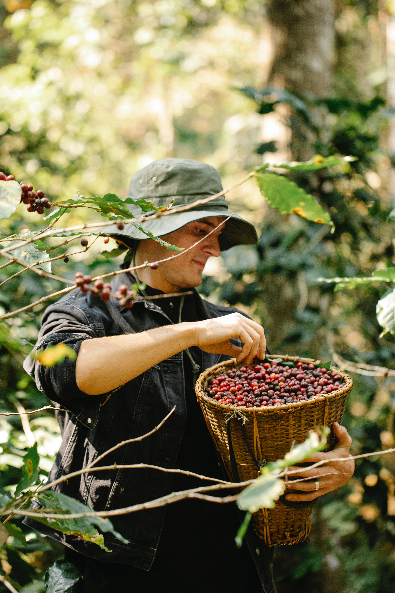

# Exploring Coffee's Global Journey: From Farm to Cup

*Published on: June 25, 2023*

*Author: Coffee Aficionado - Michael Burrows*

Have you ever wondered about the journey your morning cup of coffee takes before it reaches your lips? Coffee's path from farm to cup is a fascinating journey that spans across continents and involves countless hands. Let's take a closer look at this incredible process.

*It all begins on coffee farms situated in lush, equatorial regions. Coffee beans grow on trees, usually as cherries that ripen to vibrant red hues. The journey continues with a series of meticulous steps:*

- **Harvesting:** Skilled farmers handpick ripe coffee cherries, ensuring only the best are chosen for processing.

- **Processing:** The cherries are processed to remove the pulp and extract the beans. This step varies based on the method used – washed, natural, or honey.

- **Drying:** Beans are sun-dried until they reach the ideal moisture level for storage and export.

- **Milling and Export:** The dried beans are milled to remove the protective parchment layer and sorted. They are then exported to coffee roasters around the world.

- **Roasting:** Roasters carefully roast the beans to unlock their unique flavors and aromas. This step requires expertise and artistry.

- **Brewing:** The final stage takes place in your kitchen or your favorite café. The beans are ground, brewed, and served as that delightful cup of coffee you enjoy.

**Share Links:** [Facebook] [Twitter] [LinkedIn] [Email]

*Next time you sip your coffee, remember the incredible journey it has undertaken. Every cup tells a story of dedication, passion, and a worldwide community that comes together to bring you the perfect brew.*
