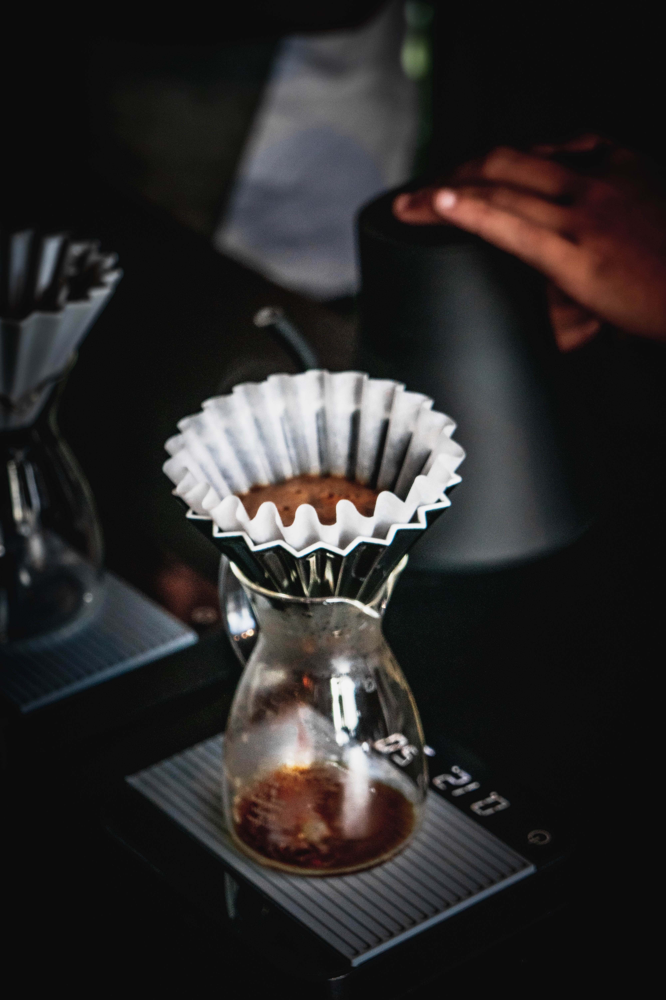

# **Sustainable Sipping: Our Commitment to Ethical Coffee Sourcing**

*Published on: July 2, 2023*

#### **Introduction:**

At Beans & Brews, we don't just brew exceptional coffee; we brew a better world. Our commitment to ethical coffee sourcing is at the heart of everything we do. Join us as we delve into our journey toward sustainability and learn how every cup you enjoy supports responsible practices.

#### **Direct Trade Connections:**

We believe in forging direct relationships with coffee farmers. Through direct trade, we ensure that our partners receive fair compensation for their hard work. This not only empowers farmers but also guarantees that you're sipping on coffee that's been ethically sourced.

#### **Environmental Stewardship:**

Preserving the environment is a priority for us. We source coffee from farms that prioritize sustainable farming practices. From shade-grown coffee to water-conscious cultivation, we're dedicated to minimizing our ecological footprint.

#### **Empowering Communities:**

Our commitment extends beyond the coffee beans. Through various initiatives, we support coffee-growing communities. From educational programs to health initiatives, we're proud to contribute positively to the lives of those who make our coffee possible.

#### **Sip Responsibly:**

By choosing Beans & Brews, you're not just enjoying a cup of coffee; you're making a conscious choice to support ethical practices. Sip responsibly and join us in creating a brighter future for coffee communities and the planet.

*Share this article:*
[Facebook](https://www.facebook.com/share?url=article-url)
[Twitter](https://twitter.com/share?url=article-url)
[LinkedIn](https://www.linkedin.com/shareArticle?url=article-url)

